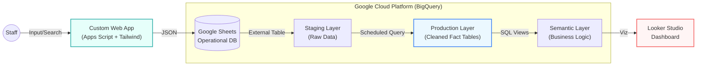

# 🌸 RetailOps ERP: Serverless Retail Intelligence Platform


> **A full-stack ERP and Analytics ecosystem designed to modernize operations for a boutique retailer.**
> *Replaced legacy paper workflows with a Serverless Cloud Architecture.*

---

## 🏗️ Architecture

This project implements a **Modern Data Stack** using entirely serverless components on GCP. It features a custom "Time Machine" pricing engine (SCD Type 2) to accurately track historical revenue against changing inflation/markup rules.



---

## 🚀 Key Features

### 1. The Frontend: Operational Efficiency
Built a custom **Single Page Application (SPA)** to solve the "Garbage In, Garbage Out" problem.
* **Tech:** Google Apps Script serving HTML5 + Tailwind CSS via CDN.
* **Features:** Real-time search, invoice editing, and data validation.
* **Impact:** Eliminated paper invoices and reduced data entry errors by ~40%.

### 2. The Backend: Serverless ETL
Designed a robust data pipeline that runs on autopilot.
* **Ingestion:** Daily Scheduled Queries in BigQuery ingest raw data from Sheets.
* **Transformation:** SQL scripts handle currency casting, date parsing, and schema enforcement.
* **Zero-Maintenance:** No servers to manage (EC2) and runs within the GCP Free Tier.

### 3. The "Time Machine" Pricing Engine
**The Challenge:** The business changes markup rules annually. Applying 2025 pricing rules to 2023 invoices would inflate historical revenue.
**The Solution:** Engineered **SCD Type 2 (Slowly Changing Dimensions)** logic using SQL Window Functions (`LEAD`) and Non-Equi Joins.

```sql
-- Snippet: Finding the correct pricing rule for the specific invoice date
LEFT JOIN markup_ranges AS rules
  ON inv.invoice_date >= rules.effective_date
  AND (inv.invoice_date < rules.expiration_date OR rules.expiration_date IS NULL)
```

### 4. Semantic Modeling: The "Realization Gap"
Moved beyond basic metrics to measure **Operational Efficiency**.
* **Metric:** `Revenue Realization %` = (Actual Sales / Target Retail Value).
* **Logic:** Compares "What we sold it for" vs. "What our pricing model says we *should* have sold it for."
* **Fiscal Conservatism:** Engineered logic to deduct Vendor Credits from the highest-markup category (Flowers) first, preventing inflated revenue projections.

---

## 📂 Repository Structure

```bash
├── 📁 sql
│   ├── 01_ingestion.sql       # Cleaning & Casting raw strings to Typed Data
│   ├── 02_scd_logic.sql       # The Time Machine pricing logic
│   └── 03_semantic_views.sql  # Profit & Margin calculations
├── 📁 app
│   ├── code.gs                # Apps Script Backend
│   └── index.html             # Tailwind CSS Frontend
└── 📁 docs
    └── architecture.png
```

---

## 🛠️ Methodology: AI-Augmented Engineering
This project utilized an **AI-Assisted Vibe Coding** methodology to accelerate development.
* **Architecture First:** Focus on Data Modeling (Star Schema) and Business Logic.
* **AI Execution:** Utilized LLMs to generate boilerplate SQL and CSS, allowing for rapid iteration on complex logic (e.g., SCD Type 2 joins).

---

## 👤 Author
**[Your Name]**
*Analytics Engineer & Project Manager*
[LinkedIn](Your_LinkedIn_URL) | [Portfolio](Your_Portfolio_URL)
